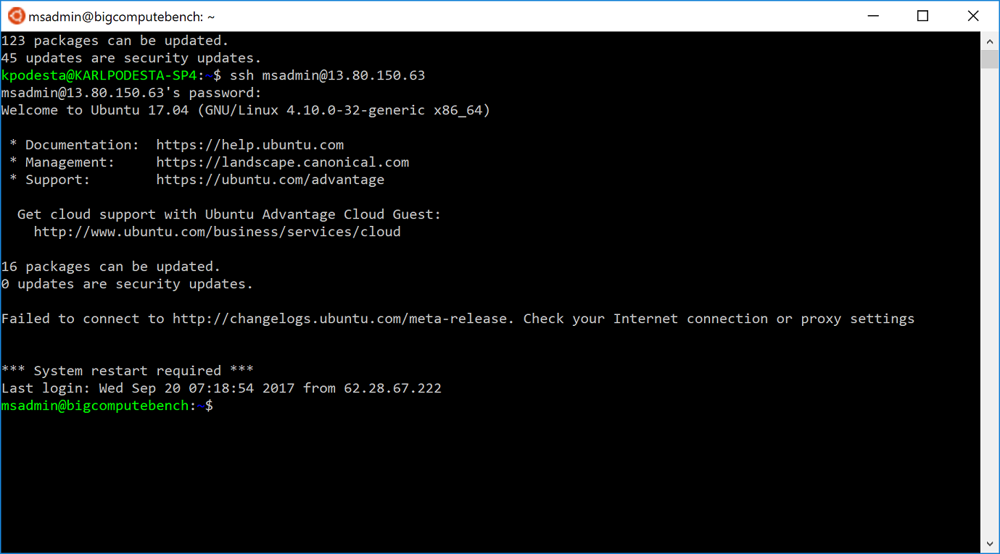
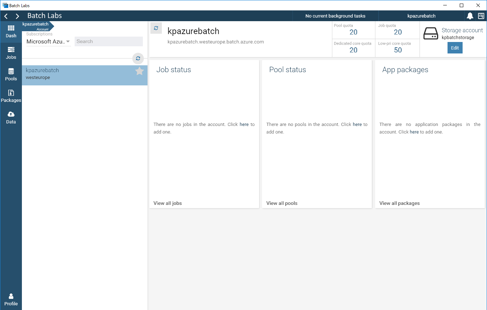
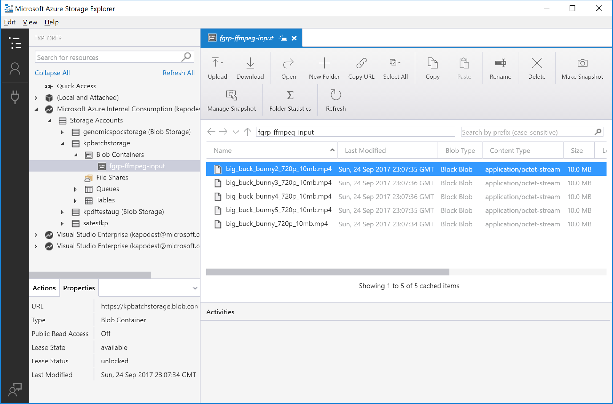
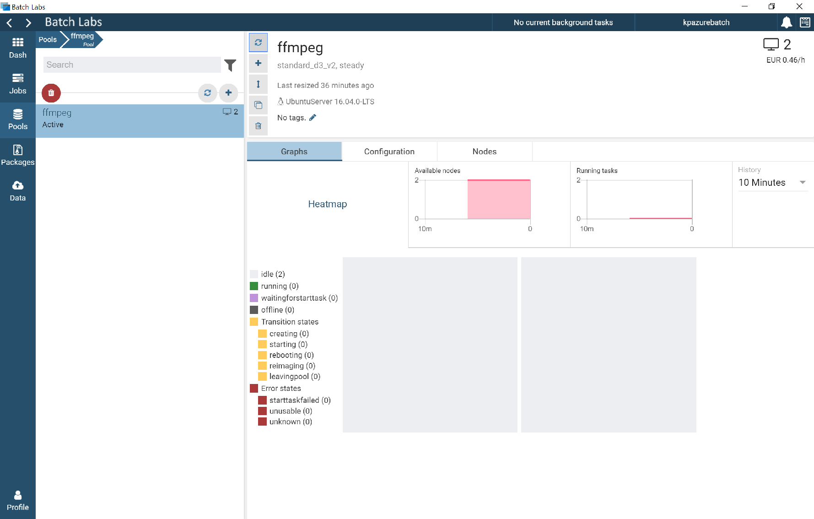
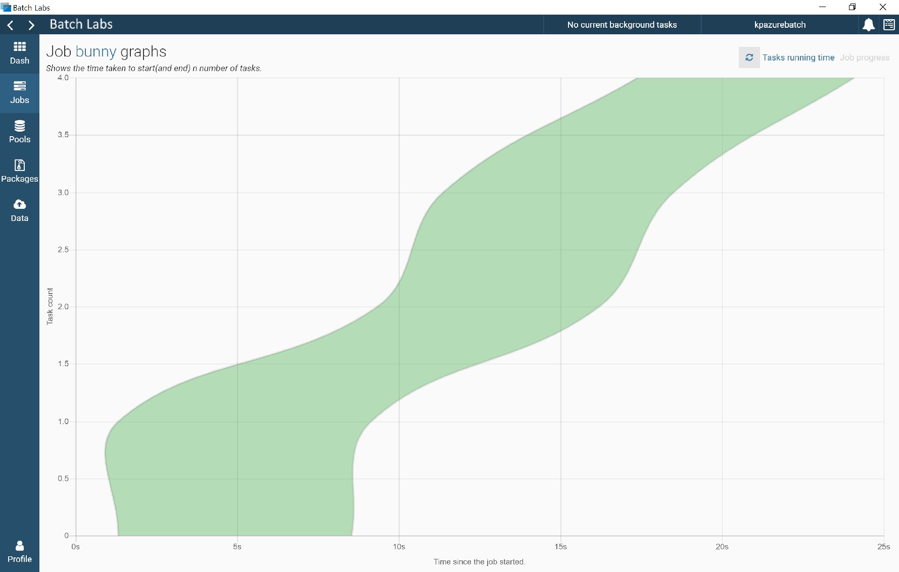

# Azure Batch HPC (Big Compute) Lab
* Microsoft EMEA Big Compute (HPC) Team - <mailto:EMEAGBBBigComputeTSP @ microsoft.com>
* Initial versions by Karl Podesta, September 2017
* Edited and adapted for FastTrack for Azure by Mike Warrington, May 2018

## 1. Introduction

### 1.1  The Lab
This is a technical lab to help you get started with Azure Batch. You will log in to Azure, initiate Azure Batch, and run a sample job.  You will learn about some of the different methods for doing this, and some of the different jobs you could run.  You will also learn where to get more information, and how to dig deeper for your particular use case.  The Lab should take approx 90 minutes to complete.  

Please share any thoughts, feedback, or improvements - this is a work in progress, and we want to make sure it helps you to get started in the right way with Azure Batch! 

### 1.2  Azure Batch
Azure Batch is a scalable job scheduling system leveraging the Microsoft Azure Cloud. Users can specify what their jobs are (e.g., executing a binary to process text data), when to run them, where to run them, and on what VM resources they are run on. The Azure Batch service takes care of the rest including: compute resource provisioning, task scheduling, automatic task recovery and retry on failure, automatic scaling of resources if specified, and many other complexities that exist at cloud-scale. There is no extra cost to use Azure Batch - Azure Batch is provided as a free value-added service on top of compute resources in Azure. Costs are incurred only for compute resources consumed and any assoicated datacenter data egress and storage costs, i.e., the same cost as if consuming Virtual Machines or Cloud Services directly.
Azure Batch can handle workloads on any point of the parallel and distributed processing spectrum, from embarassingly parallel workloads all the way to tightly-coupled message passing codes such as MPI jobs on Infiniband/RDMA.
If this is your first time with Azure Batch, you might want to read the <a href="https://docs.microsoft.com/en-us/azure/batch/batch-technical-overview">Azure Batch Overview</a> to get familiar with the concepts of Pools, Jobs, and Tasks. 

## 2. Install & Setup

The following steps will be needed for setup:
1. Login to Azure
2. Create an Azure Batch account and an Azure Storage Account (or use an existing one)
3. Change/Review Azure limits
4. Download the "Batch Labs" GUI tool (beta) [optional]
5. Download the "Storage Explorer" GUI tool
6. Create a Linux workstation (and connect to it)

### 2.1 Login to Azure
You can access Azure via <a href="https://portal.azure.com">https://portal.azure.com</a>.  You may have a subscription already.  If not, you can sign up for a subscription. 

### 2.2 Create an Azure Batch account (or use an existing one)
In the Azure Portal, go to "+ Create a resource", type "Azure Batch", and select "Batch Service".
Click "Create" and enter an account name, and a resource group where this Azure Batch account will live.
Select an existing, or create a new, storage account. This will be used for input/ouput files for Azure Batch Jobs.

We will be using the Azure Batch Account name and the Azure Batch Account URL. The URL can be found on the overview display for the account. 

Full details for creating an Azure Batch account are at this link: <a href="https://docs.microsoft.com/en-us/azure/batch/batch-account-create-portal">Create Azure Batch Account</a>. 

### 2.3 Change/Review Azure limits
There are default quotas and limits that apply to your Azure Batch account.  See here for more information: <a href="https://docs.microsoft.com/en-us/azure/batch/batch-quota-limit">Azure Batch Quotas and Limits</a>. 
You can find further details on that webpage for changing these quotas.  For our workshop, we will use the quotas we have already. 

### 2.4 Download the "Batch Labs" GUI tool (beta) 
You can download a recent build of "Batch Labs" for Windows from this GitHub repository (See "BatchLabs Setup 0.15.0.exe" file, as of May 2018). 
If you want to get the very latest version, and compile the code yourself or download the setup exe for immediate installation, the link for that is here: <a href="https://github.com/Azure/BatchLabs/releases">Azure Batch Labs (beta)</a>.

### 2.5 Download the "Azure Storage Explorer" GUI tool
This is a nice GUI tool you can use to interact with your storage on Azure.  You can download it from here: <a href="https://azure.microsoft.com/en-gb/features/storage-explorer/">Azure Storage Explorer</a>. 

### 2.6 Create a workstation
In order to develop your Azure Batch job, and submit your job, you will do this from a workstation.  The following link will allow you to create a (Linux - Ubuntu 17.04) workstation in Azure, with all the dependencies you need. You can click on the "Deploy to Azure" button, and the workstation will take a few minutes to deploy.  Once it is deployed, you can inspect the connection details (public IP address, with the username and password you entered), and connect to this via SSH (e.g. if on Windows, you can use "PuTTY" software to connect).  

The link is here: <a href="https://github.com/mikewarr/FTA-HPC-AzureBatch/tree/demo-1.1/BatchMasterClass/ftaComputeBench">Create Linux Workstation</a>.

__Warning: you may want to shut down your Linux workstation when you complete the lab, as there is no security configured__

## 3. Access & Use

Connect to your new Linux workstation via SSH.  You can use command line (e.g. on Linux, or on Windows with WSL installed), or e.g. PuTTY on Windows.  The PuTTY tool is available for download from here: <a href="https://www.chiark.greenend.org.uk/~sgtatham/putty/latest.html">PuTTY download</a>. 

Load up Azure BatchLabs, select your subscription, and your storage account. 

## 4. Complete an Azure Batch job

We will be following instructions to <a href="https://docs.microsoft.com/en-us/azure/batch/batch-cli-templates">Run Batch jobs without code</a>. 

The following steps will be followed to complete a job: 
1. Upgrade the Azure CLI
2. Upload files to Azure Batch
3. Check templates
4. Create a pool
5. Run a job
6. Monitor a job
7. Collect and view results

### 4.1 Upgrade the Azure CLI 

You will need to upgrade the "Azure CLI" package on your Linux workstation:

	
	AZ_REPO=$(lsb_release -cs)
	
	echo "deb [arch=amd64] https://packages.microsoft.com/repos/azure-cli/ $AZ_REPO main" | \
     sudo tee /etc/apt/sources.list.d/azure-cli.list
    
	sudo apt-key adv --keyserver packages.microsoft.com --recv-keys 52E16F86FEE04B979B07E28DB02C46DF417A0893

	curl -L https://packages.microsoft.com/keys/microsoft.asc | sudo apt-key add -

	sudo apt-get update

	sudo apt-get install apt-transport-https

	sudo apt-get update && sudo apt-get install azure-cli

az extension add --source https://github.com/Azure/azure-batch-cli-extensions/releases/download/azure-batch-cli-extensions-2.2.2/azure_batch_cli_extensions-2.2.2-py2.py3-none-any.whl

Check your Azure Login is working: 

	az login
	az account list

### 4.2 Upload files to Azure Batch

Before uploading files to Azure, we will have to find some files to upload! Here, we download a sample video (.mp4) file. We copy this a number of times to give us some input video samples for our job. 

	mkdir samples
	cd samples
	wget http://sample-videos.com/video/mp4/720/big_buck_bunny_720p_30mb.mp4
	cp big_buck_bunny_720p_30mb.mp4 big_buck_bunny2_720p_30mb.mp4
	cp big_buck_bunny_720p_30mb.mp4 big_buck_bunny3_720p_30mb.mp4
	cp big_buck_bunny_720p_30mb.mp4 big_buck_bunny4_720p_30mb.mp4
	cp big_buck_bunny_720p_30mb.mp4 big_buck_bunny5_720p_30mb.mp4
	cp big_buck_bunny_720p_30mb.mp4 big_buck_bunny6_720p_30mb.mp4
	cp big_buck_bunny_720p_30mb.mp4 big_buck_bunny7_720p_30mb.mp4
	cp big_buck_bunny_720p_30mb.mp4 big_buck_bunny8_720p_30mb.mp4
	cp big_buck_bunny_720p_30mb.mp4 big_buck_bunny9_720p_30mb.mp4
	cp big_buck_bunny_720p_30mb.mp4 big_buck_bunny10_720p_30mb.mp4

Now that we have some video sample .mp4 files, we are ready to upload these to Azure Batch: 

	az batch file upload --local-path . --file-group ffmpeg-input --account-name myazurebatch --account-endpoint myazurebatch.westeurope.batch.azure.com

Take a look at these uploaded files, via Azure Storage Explorer: 

### 4.3 Check templates

We are using "pool-ffmpeg.json" and "job-ffmpeg.json". You can find these in this GitHub repo.

Download these files to your Linux workstation.  Review the files with "less pool-ffmpeg.json" (for example).  

	wget https://raw.githubusercontent.com/karlpodesta/azure-batch-hpc-lab/master/pool-ffmpeg.json
	wget https://raw.githubusercontent.com/karlpodesta/azure-batch-hpc-lab/master/job-ffmpeg.json

The "pool-ffmpeg" will help us create a pool of Linux workstations to run on.  The "job-ffmpeg" will help us create our job.  

### 4.4 Create a pool

See the command below to create the pool. Also note the input required to the template (i.e. "poolId" and "nodeCount"). 

	msadmin@bigcomputebench:~$ az batch pool create --template pool-ffmpeg.json --account-name myazurebatch --account-endpoint myazurebatch.westeurope.batch.azure.com
	You are using an experimental feature {Pool Template}.
	poolId (The pool id ): ffmpeg
	nodeCount (The number of pool nodes): 2
	You are using an experimental feature {Package Management}.

See if your pool was created, via BatchLabs: 

### 4.5 Run a job

Here, we will actually run the job. 

	msadmin@bigcomputebench:~$ az batch job create --template job-ffmpeg.json --account-name myazurebatch --account-endpoint myazurebatch.westeurope.batch.azure.com
	You are using an experimental feature {Job Template}.
	jobId (The name of Azure Batch job): bunny
	poolId (The name of Azure Batch pool which runs the job): ffmpeg
	You are using an experimental feature {Task Factory}.

### 4.6 Monitor a job

In Azure BatchLabs, click "Jobs". You should see a list of jobs on the left panel. Click on a job. From here you can go to "Job Statistics", to see more information about the job.  Click "Job Progress" to see an overview graph of the completed job. 

### 4.7 Collect and view results

Go to the Azure Storage Explorer. Go to your Storage account, then your Batch Storage account, then "Blobs". You should see "fgrp-ffmpeg-output".  If you click on this, you will see a list of transcoded videos - the output of your job.  You can also see the output via BatchLabs. 

## 5. Improving the job

* What could be done to improve the job? 
* What will happen as we scale? (bigger videos, larger videos)
* What is the difference between "one job with many tasks" and "many jobs with one task"?
* Can you imagine other scenarios you would use this for in your work? (e.g. Fiji/ImageJ, CellProfiler)

## 6. Other Scenarios
* __Azure Batch with Containers:__ <a href="https://github.com/Azure/batch-shipyard/blob/master/docs/02-batch-shipyard-quickstart.md">Azure Batch Shipyard - Get Started</a>
* __Azure Batch for Rendering:__ <a href="https://docs.microsoft.com/en-us/azure/batch/batch-rendering-service">Azure Batch Rendering Service</a>
* __Azure Batch for AI:__ <a href="https://batchaitraining.azure.com/">Azure Batch AI (preview)</a>
* __Data Analytics - R and doAzureParallel:__ <a href="https://azure.microsoft.com/en-us/blog/doazureparallel/">doAzureParallel - directly from R session</a>

## 7. Links & References
* <a href="https://docs.microsoft.com/en-us/azure/batch/">Azure Batch Service</a> - High level information about the Azure Batch service
* <a href="https://github.com/Azure/batch-shipyard">Azure Batch Shipyard</a> - Azure Batch + Docker containers = easy solutions!
* <a href="https://github.com/Azure/azure-batch-cli-extensions">Azure Batch CLI extensions (preview)</a> - new functionality for the Azure CLI!
* <a href="https://github.com/Azure/BatchLabs/releases">Azure Batch Labs (beta)</a> - GUI tool to monitor & manage Azure Batch workloads
* <a href="https://docs.microsoft.com/en-us/azure/storage/storage-use-azcopy">AzCopy (Windows)</a> - command line tool for copying data to Azure, fast!
* <a href="https://docs.microsoft.com/en-us/azure/storage/storage-use-azcopy-linux">AzCopy (Linux)</a> - command line tool for copying data to Azure, fast!

